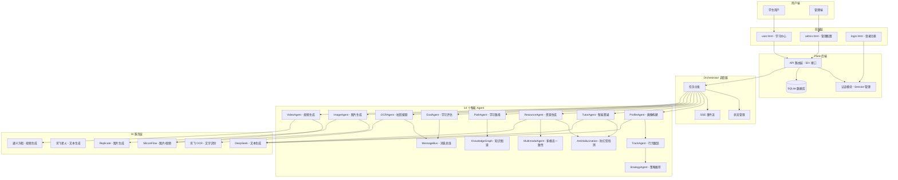
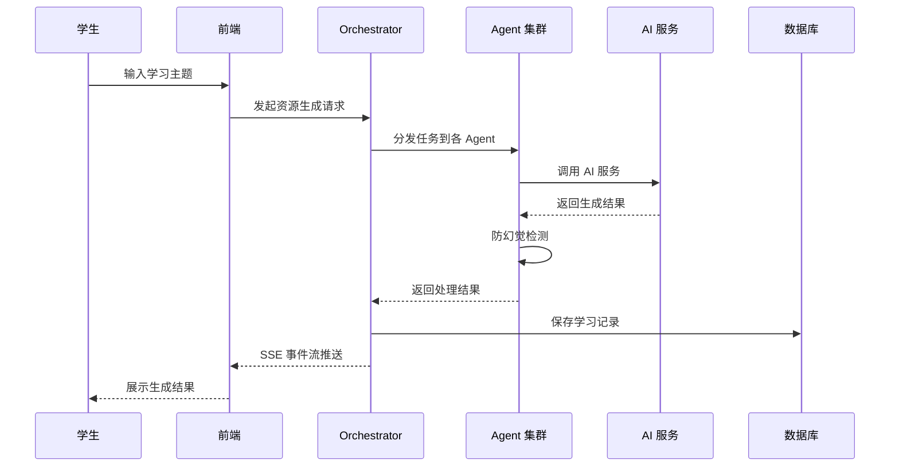
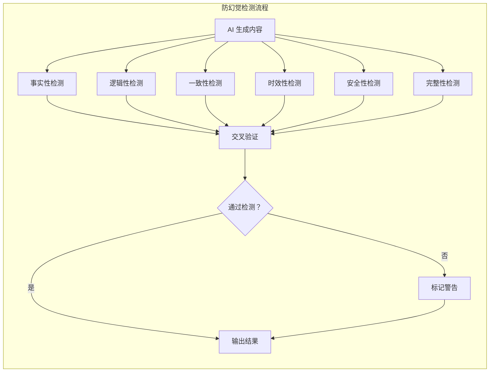
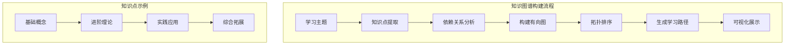
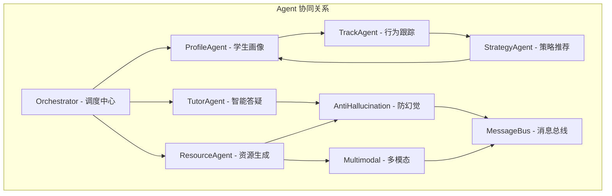

# 多智能体学习系统 - 系统架构图

## 1. 整体架构

```mermaid
graph TB
    subgraph "用户端"
        U1[学生用户]
        U2[管理端]
    end
    
    subgraph "前端层"
        F1[user.html - 学习中心]
        F2[admin.html - 管理配置]
        F3[login.html - 登录注册]
    end
    
    subgraph "Flask 后端"
        API[API 路由层 - 50+ 接口]
        Auth[认证模块 - Session 管理]
        DB[(SQLite 数据库)]
    end
    
    subgraph "Orchestrator 调度器"
        O1[任务分发]
        O2[状态管理]
        O3[SSE 事件流]
    end
    
    subgraph "14 个智能 Agent"
        A1[ProfileAgent - 画像构建]
        A2[TutorAgent - 智能答疑]
        A3[ResourceAgent - 资源生成]
        A4[PathAgent - 学习路径]
        A5[EvalAgent - 学习评估]
        A6[OCRAgent - 拍照搜题]
        A7[ImageAgent - 图片生成]
        A8[VideoAgent - 视频生成]
        A9[AntiHallucination - 防幻觉检测]
        A10[KnowledgeGraph - 知识图谱]
        A11[MessageBus - 消息总线]
        A12[TrackAgent - 行为跟踪]
        A13[StrategyAgent - 策略推荐]
        A14[MultimodalAgent - 多模态一致性]
    end
    
    subgraph "AI 服务层"
        AI1[DeepSeek - 文本生成]
        AI2[讯飞星火 - 文本生成]
        AI3[SiliconFlow - 图片/视频]
        AI4[Replicate - 图片生成]
        AI5[通义万相 - 视频生成]
        AI6[讯飞 OCR - 文字识别]
    end
    
    U1 --> F1
    U2 --> F2
    F1 --> API
    F2 --> API
    F3 --> Auth
    API --> Auth
    API --> DB
    API --> O1
    O1 --> O2
    O1 --> O3
    O1 --> A1
    O1 --> A2
    O1 --> A3
    O1 --> A4
    O1 --> A5
    O1 --> A6
    O1 --> A7
    O1 --> A8
    A2 --> A9
    A3 --> A9
    A4 --> A10
    A5 --> A11
    A6 --> A11
    A1 --> A12
    A12 --> A13
    A3 --> A14
    
    A1 --> AI1
    A2 --> AI1
    A3 --> AI1
    A6 --> AI6
    A7 --> AI3
    A7 --> AI4
    A8 --> AI3
    A8 --> AI5
```

## 2. 数据流图

```mermaid
sequenceDiagram
    participant U as 学生
    participant F as 前端
    participant O as Orchestrator
    participant A as Agent 集群
    participant AI as AI 服务
    participant DB as 数据库
    
    U->>F: 输入学习主题
    F->>O: 发起资源生成请求
    O->>A: 分发任务到各 Agent
    A->>AI: 调用 AI 服务
    AI-->>A: 返回生成结果
    A->>A: 防幻觉检测
    A-->>O: 返回处理结果
    O->>DB: 保存学习记录
    O-->>F: SSE 事件流推送
    F-->>U: 展示生成结果
```

## 3. 防幻觉机制

```mermaid
graph LR
    subgraph "防幻觉检测流程"
        R[AI 生成内容] --> D1[事实性检测]
        R --> D2[逻辑性检测]
        R --> D3[一致性检测]
        R --> D4[时效性检测]
        R --> D5[安全性检测]
        R --> D6[完整性检测]
        
        D1 --> V[交叉验证]
        D2 --> V
        D3 --> V
        D4 --> V
        D5 --> V
        D6 --> V
        
        V --> P{通过检测？}
        P -->|是| O[输出结果]
        P -->|否| F[标记警告]
        F --> O
    end
```

## 4. 知识图谱构建

```mermaid
graph TD
    subgraph "知识图谱构建流程"
        T[学习主题] --> E[知识点提取]
        E --> R[依赖关系分析]
        R --> G[构建有向图]
        G --> S[拓扑排序]
        S --> P[生成学习路径]
        P --> V[可视化展示]
    end
    
    subgraph "知识点示例"
        K1[基础概念] --> K2[进阶理论]
        K2 --> K3[实践应用]
        K3 --> K4[综合拓展]
    end
```

## 5. 多智能体协同

```mermaid
graph TB
    subgraph "Agent 协同关系"
        O[Orchestrator - 调度中心]
        
        O --> P[ProfileAgent - 学生画像]
        O --> T[TutorAgent - 智能答疑]
        O --> R[ResourceAgent - 资源生成]
        
        P --> TK[TrackAgent - 行为跟踪]
        T --> AH[AntiHallucination - 防幻觉]
        R --> AH
        R --> MM[Multimodal - 多模态]
        
        TK --> S[StrategyAgent - 策略推荐]
        S --> P
        
        AH --> MB[MessageBus - 消息总线]
        MM --> MB
    end
```